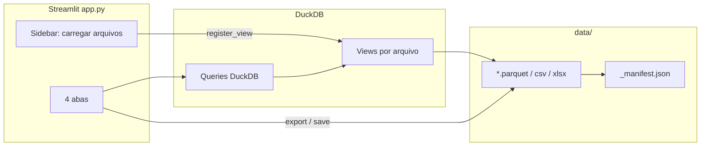

# Parquet Query — Especificação Viva

> **Última atualização:** 2026-06-17  
> **Versão do spec:** 1.5.1  
> **Mantenedor:** IA + desenvolvedor (atualização contínua a cada prompt relevante)

---

## Protocolo de manutenção (obrigatório para a IA)

Este arquivo é a **fonte única de verdade** sobre o contexto do projeto. A IA deve:

1. **Ler** `LIVING_SPEC.md` no início de qualquer tarefa não trivial.
2. **Atualizar** este arquivo ao final de cada sessão que altere comportamento, arquitetura, arquivos ou convenções.
3. **Registrar** mudanças na seção [Changelog](#changelog) com data, resumo e arquivos tocados.
4. **Incrementar** `Versão do spec` (patch: correções/docs; minor: features; major: redesign).
5. **Não duplicar** regras longas em outros lugares — aponte para seções deste arquivo.

Campos a revisar em cada atualização: `Última atualização`, módulos, fluxos, dependências, estado do git conhecido, decisões abertas.

---

## Visão geral

**Parquet Query** é uma aplicação **Streamlit** para explorar arquivos Parquet (e derivados) com **DuckDB**, sem carregar datasets inteiros na RAM quando possível. Suporta SQL ad-hoc, colunas calculadas (DuckDB ou DAX do Power BI) e exportação versionada para `data/`.

| Item | Valor |
|------|-------|
| Linguagem | Python 3.x |
| UI | Streamlit (`layout="wide"`) |
| Engine SQL | DuckDB (conexão singleton por sessão do servidor) |
| Dados | `data/` (versionado + manifest) |
| Entrada | `.parquet` e `.csv` em `data/` |
| Saída | Parquet, CSV, XLSX |

**Executar:** `streamlit run app.py` ou `run.bat`

---

## Estrutura do repositório

```
Parquet Query/
├── app.py                 # UI Streamlit + lógica de queries/export
├── data_store.py          # Versionamento, manifest, migração legacy
├── pq_dax_translator.py   # Tradutor DAX → SQL DuckDB
├── pq_m_translator.py     # Tradutor Power Query (M) → SQL DuckDB
├── data/                  # Arquivos de dados + _manifest.json
├── utils/                 # Scripts utilitários (conversão parquet→csv/xlsx)
├── requirements.txt
├── run.bat
└── LIVING_SPEC.md         # Este arquivo
```

### Responsabilidades por módulo

| Arquivo | Papel |
|---------|-------|
| `app.py` | Ponto de entrada; sidebar (carregar parquets/CSV); 4 abas; session state; helpers DuckDB/paginação/export |
| `data_store.py` | Nomenclatura `{base}_v{N}`, timeline, `_manifest.json`, migração `input/`/`output/` → `data/` |
| `pq_dax_translator.py` | Tokenizer/parser DAX; `translate_power_column`, `normalize_power_formula`; `ParseError` |
| `pq_m_translator.py` | Passos M (`Table.SelectRows`, `TransformColumnTypes`, `RemoveColumns`, `SelectColumns`) → SQL DuckDB com CTEs; `translate_m_to_sql`, `m_source_table` |

---

## Arquitetura



### Fluxo de dados

1. Usuário marca arquivos (`.parquet` / `.csv`) na sidebar → `register_view(stem, path)` cria view DuckDB (`read_parquet` ou `read_csv_auto`).
2. Tabela ativa usa `work_from(table)` — `"tabela"` ou `({sql_derivado}) __work__` quando há colunas calculadas.
3. Transformações na aba **Colunas** empilham via `build_derived_select` em `derived_by_table`.
4. Export grava em `data/{base}_v{N}.{ext}` e atualiza manifest via `record_version`.

---

## Modelo de versionamento (`data/`)

| Conceito | Regra |
|----------|-------|
| Original | `{base}.parquet` (sem sufixo `_vN`) → versão lógica `0` / label `original` |
| Versões | `{base}_v1.parquet`, `{base}_v2.parquet`, ... |
| Manifest | `data/_manifest.json` — metadados por base/versão (formato, origem, timestamps) |
| Timeline | `build_timeline(data_dir, base)` — original + todas as `_vN` |

Funções-chave em `data_store.py`: `base_name_from`, `version_from_stem`, `versioned_stem`, `next_available_version`, `record_version`, `migrate_legacy_dirs`.

---

## Interface (abas)

| # | Aba | Função |
|---|-----|--------|
| 1 | Explorar | Schema, preview paginado, overview de valores (classificatório ou numérico) |
| 2 | SQL | Editor DuckDB com autocomplete; tradutor Power Query (M); paginação server-side para SELECT/WITH |
| 3 | Colunas | Coluna calculada (DuckDB ou DAX), renomear, remover, TRY_CAST |
| 4 | Exportar | Download ou salvar em `data/`; nova versão ou sobrescrever; timeline |

### Session state (`app.py`)

| Chave | Uso |
|-------|-----|
| `loaded_tables` | Lista de stems carregados |
| `derived_by_table` | `{table: sql_derivado}` |
| `last_result_sql` | Último SQL executado na aba SQL |
| `sql_editor` | Dict do componente `code_editor` (`text`, cursor, etc.) |
| `sql_editor_ctx` | `{tabela}:raw` ou `:derived` — troca reseta o editor |
| `sql_last_submit_id` | Último `id` de Ctrl+Enter processado (evita reexecução) |
| `active_table` | Via `selectbox` na sidebar |

Caches Streamlit: `get_con` (`@st.cache_resource`), schema/overview (`@st.cache_data`, ttl=300). `set_derived_sql` limpa cache de `get_classificatory_overview` e `get_numeric_overview`.

### Overview de valores (Explorar)

Radio **Classificatório** / **Numérico** (escolha manual):

| Modo | Controles | Resultado |
|------|-----------|-----------|
| **Classificatório** | Coluna | Frequências por valor (`GROUP BY`), tabela paginada |
| **Numérico** | Coluna + agregação (MIN, MAX, SUM, AVG) | Um único valor formatado pt-BR (`.` milhar, `,` decimal) |

VARCHAR no modo numérico usa `TRY_CAST(TRIM(col) AS DOUBLE)`. Helper: `format_number_pt`.

---

## Tradutor M (`pq_m_translator.py`)

- Entrada: passos M encadeados (`#"Nome" = Table....,`).
- Suportado: `Table.SelectRows`, `Table.TransformColumnTypes`, `Table.RemoveColumns`, `Table.SelectColumns`.
- Parâmetros M: definidos no script (`Nome = #date(...)`) ou inferidos em predicados `each`; CTE `params` genérica.
- `table_map` renomeia tabela de origem M para view DuckDB carregada.
- API: `translate_m_to_sql`, `m_source_table`, `m_parameter_names`, `m_parameter_defaults`, `parse_m_script`; erros: `ParseError`.

---

## Tradutor DAX (`pq_dax_translator.py`)

- Entrada: `Nome da Coluna = expressão` (formato Power BI).
- `normalize_power_formula` limpa referências `'Tabela'[Coluna]` → colunas da view atual.
- Suporte parcial: IF, VAR/RETURN, comentários `--`/`//`, SUBSTITUTE, FIND, SEARCH, TRIM, LEFT, FORMAT, TODAY, `.[Date]`, `.[Year]`, operadores, strings.
- Erros: `ParseError` (herda `ValueError`).
- API pública: `translate_power_column`, `translate_dax_expression`, `normalize_power_formula`.

---

## Convenções de código

- Python com `from __future__ import annotations`.
- Paths via `pathlib.Path`; SQL com identificadores entre aspas duplas `"coluna"`.
- Subqueries derivadas: `work_from()` → `"coluna"` ou `({derived}) __work__`; validação interna usa `__validate__`.
- Paginação pesada: `paginate_sql` (COUNT + LIMIT/OFFSET no DuckDB), não `paginate` em DataFrame grande.
- UI de paginação: `show_paginated_dataframe` + `render_pagination_bar` — `st.container(horizontal=True)` com botões ◀/▶ colados ao texto, centralizado abaixo da tabela; estado em `pg_{key}`.
- Limite XLSX: `LIMITE_XLSX = 1_048_576` (limite do Excel).
- UI em português; mensagens de erro amigáveis via `st.error` / `st.warning`.
- **Escopo mínimo:** alterações focadas; não refatorar sem pedido; seguir estilo existente.

---

## Dependências (`requirements.txt`)

```
pandas>=2.0
pyarrow>=14.0
openpyxl>=3.1
duckdb>=1.0
streamlit>=1.35
streamlit-code-editor>=0.1.22
```

---

## Estado conhecido / decisões

| Tópico | Status |
|--------|--------|
| `utils/parquet_to_csv.py`, `utils/parquet_to_xlsx.py` | Marcados como deletados no git (D no status); scripts standalone de conversão |
| Diretórios legacy `input/`, `output/` | Migrados automaticamente para `data/` na primeira execução |
| Testes automatizados | Não existem ainda |
| Autenticação / multi-usuário | Não aplicável (app local) |

---

## Tarefas comuns para a IA

- **Nova feature na UI:** editar `app.py`; manter padrão de abas/subtabs; usar `work_sql` como base SQL.
- **Versionamento/export:** usar `data_store.record_version` + `save_to_data`.
- **Nova função DAX:** estender `pq_dax_translator.py` (`_Parser`, mapeamentos de funções).
- **Novo formato de arquivo:** atualizar `LOADABLE_EXTENSIONS`, `duckdb_read_expr`, `export_to_bytes`, `save_to_data`.

---

## Changelog

### 2026-06-17 — v1.5.1 (parâmetros M genéricos)

- Tradutor M: parâmetros detectados automaticamente (definições `#date` / literais ou uso em `each`); UI dinâmica; removidos defaults fixos RangeStart/RangeEnd.
- API: `m_parameter_names`, `m_parameter_defaults`, `parse_m_script`.
- Arquivos: `pq_m_translator.py`, `app.py`, `LIVING_SPEC.md`.

### 2026-06-17 — v1.5.0 (tradutor Power Query M)

- Novo `pq_m_translator.py`: converte passos M comuns em SQL DuckDB (CTEs, params de data, filtros, casts, colunas).
- Aba SQL: expander «Tradutor Power Query (M)» com conversão e «Usar no editor».
- Arquivos: `pq_m_translator.py`, `app.py`, `LIVING_SPEC.md`.

### 2026-06-17 — v1.4.3 (Ctrl+Enter executar SQL)

- Aba SQL: **Ctrl+Enter** dispara execução via comando `submit` nativo do `code_editor`.
- Helpers `execute_sql_input`, `sql_editor_run_requested`; deduplicação por `sql_last_submit_id`.
- Arquivos: `app.py`, `LIVING_SPEC.md`.

### 2026-06-17 — v1.4.2 (layout autocomplete SQL)

- Corrigido popup de sugestões cortado: `overflow: visible`, padding inferior no iframe do `code_editor`, CSS nas abas Streamlit.
- Editor SQL reposicionado acima da referência; altura 14–22 linhas; navegação por teclado documentada na caption.
- Arquivos: `app.py`, `LIVING_SPEC.md`.

### 2026-06-17 — v1.4.1 (autocomplete SQL nível A)

- Aba SQL: `st.text_area` substituído por `streamlit-code-editor` com sugestões fixas (tabelas carregadas, colunas, keywords SQL, funções DuckDB comuns).
- Novos helpers: `table_column_names`, `build_sql_completions`; constantes `SQL_KEYWORDS`, `DUCKDB_FUNCTIONS`.
- Arquivos: `app.py`, `requirements.txt`, `LIVING_SPEC.md`.

### 2026-06-16 — v1.4.0 (remoção Filtros e Agrupar)

- Removidas abas **Filtros** e **Agrupar**; app passa a ter 4 abas (Explorar, SQL, Colunas, Exportar).
- Removidos `filters` do session state, `AGGS`, `get_distinct_values`.
- Exportar: opção renomeada para «Último resultado (SQL)».
- Arquivos: `app.py`, `LIVING_SPEC.md`.

### 2026-06-16 — v1.3.7 (overview manual classificatório/numérico)

- Removida detecção automática de tipo no overview; radio alterna Classificatório vs Numérico.
- Modo numérico: selectbox de agregação (MIN/MAX/SUM/AVG) e um valor exibido com `format_number_pt` (`.` milhar, `,` decimal).
- Arquivos: `app.py`, `LIVING_SPEC.md`.

### 2026-06-16 — v1.3.6 (overview classificatório vs numérico)

- Overview de valores na aba Explorar detecta automaticamente colunas classificatórias vs numéricas/datas.
- VARCHAR com apenas valores numéricos (ex.: IDs) é tratado como numérico via `TRY_CAST`.
- Novos helpers: `column_type_category`, `resolve_overview_kind`, `_overview_value_expr`.
- Arquivos: `app.py`, `LIVING_SPEC.md`.

### 2026-06-16 — v1.3.5 (paginação inline)

- Barra de paginação usa `st.container(horizontal=True)` — botões adjacentes ao texto, sem colunas extras.
- Arquivos: `app.py`, `LIVING_SPEC.md`.

### 2026-06-16 — v1.3.4 (paginação centralizada)

- Barra de paginação compacta (`gap="small"`, botões sem largura total) e centralizada horizontalmente.
- Arquivos: `app.py`, `LIVING_SPEC.md`.

### 2026-06-16 — v1.3.3 (paginação compacta)

- Substituído `st.number_input` por barra compacta com botões ◀/▶ abaixo das tabelas paginadas.
- Novos helpers: `PageInfo`, `render_pagination_bar`, `show_paginated_dataframe`.
- Arquivos: `app.py`, `LIVING_SPEC.md`.

### 2026-06-16 — v1.3.2 (remoção SUMMARIZE)

- Removidas funções mortas `get_summarize` e `get_summarize_for` e limpezas de cache associadas.
- Arquivos: `app.py`, `LIVING_SPEC.md`.

### 2026-06-16 — v1.3.1 (Explorar: subabas)

- Removida subaba **Estatísticas** (`SUMMARIZE`) da aba Explorar.
- Ordem das subabas: Schema → Preview → Overview de valores.
- Arquivos: `app.py`, `LIVING_SPEC.md`.

### 2026-06-16 — v1.3.0 (SQL simplificado + work_from)

- Queries padrão usam `SELECT * FROM "tabela" LIMIT 100` sem subquery redundante.
- `work_from()` / `build_derived_select()` unificam base de trabalho; subquery `__work__` só com colunas calculadas.
- Editor SQL reseta ao trocar tabela ou transformações; `strip_sql` remove `;` final (evita erro na paginação).
- Arquivos: `app.py`, `LIVING_SPEC.md`.

### 2026-06-16 — v1.2.0 (DAX: strings, VAR, comentários)

- Tradutor DAX: `VAR`/`RETURN`, comentários `--`/`//`, `SUBSTITUTE`, `FIND`, `SEARCH`, `TRIM`.
- `normalize_power_formula` remove comentários antes de colapsar espaços.
- Arquivos: `pq_dax_translator.py`, `app.py`, `LIVING_SPEC.md`.

### 2026-06-16 — v1.1.0 (entrada CSV)

- Sidebar e `register_view` passam a aceitar arquivos `.csv` em `data/` via `read_csv_auto` do DuckDB.
- UI atualizada (mensagens, rótulo de formato na lista, export “arquivo original”).
- Arquivos: `app.py`, `LIVING_SPEC.md`.

### 2026-06-16 — v1.0.0 (criação do spec)

- Criado `LIVING_SPEC.md` como especificação viva inicial do projeto.
- Documentados: arquitetura Streamlit+DuckDB, versionamento em `data/`, 6 abas, session state, tradutor DAX, convenções.
- Estado git: `utils/parquet_to_csv.py` e `utils/parquet_to_xlsx.py` com status deletado.

<!-- Adicione novas entradas acima desta linha, mais recentes primeiro -->
