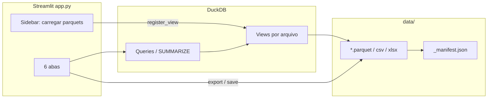

# Parquet Query — Especificação Viva

> **Última atualização:** 2026-06-16  
> **Versão do spec:** 1.0.0  
> **Mantenedor:** IA + desenvolvedor (atualização contínua a cada prompt relevante)

---

## Protocolo de manutenção (obrigatório para a IA)

Este arquivo é a **fonte única de verdade** sobre o contexto do projeto. A IA deve:

1. **Ler** `LIVING_SPEC.md` no início de qualquer tarefa não trivial.
2. **Atualizar** este arquivo ao final de cada sessão que altere comportamento, arquitetura, arquivos ou convenções.
3. **Registrar** mudanças na seção [Changelog](#changelog) com data, resumo e arquivos tocados.
4. **Incrementar** `Versão do spec` (patch: correções/docs; minor: features; major: redesign).
5. **Não duplicar** regras longas em outros lugares — aponte para seções deste arquivo.

Campos a revisar em cada atualização: `Última atualização`, módulos, fluxos, dependências, estado do git conhecido, decisões abertas.

---

## Visão geral

**Parquet Query** é uma aplicação **Streamlit** para explorar arquivos Parquet (e derivados) com **DuckDB**, sem carregar datasets inteiros na RAM quando possível. Suporta SQL ad-hoc, filtros visuais, agrupamentos, colunas calculadas (DuckDB ou DAX do Power BI) e exportação versionada para `data/`.

| Item | Valor |
|------|-------|
| Linguagem | Python 3.x |
| UI | Streamlit (`layout="wide"`) |
| Engine SQL | DuckDB (conexão singleton por sessão do servidor) |
| Dados | `data/` (versionado + manifest) |
| Entrada | `.parquet` em `data/` |
| Saída | Parquet, CSV, XLSX |

**Executar:** `streamlit run app.py` ou `run.bat`

---

## Estrutura do repositório

```
Parquet Query/
├── app.py                 # UI Streamlit + lógica de queries/export
├── data_store.py          # Versionamento, manifest, migração legacy
├── pq_dax_translator.py   # Tradutor DAX → SQL DuckDB
├── data/                  # Arquivos de dados + _manifest.json
├── utils/                 # Scripts utilitários (conversão parquet→csv/xlsx)
├── requirements.txt
├── run.bat
└── LIVING_SPEC.md         # Este arquivo
```

### Responsabilidades por módulo

| Arquivo | Papel |
|---------|-------|
| `app.py` | Ponto de entrada; sidebar (carregar parquets); 6 abas; session state; helpers DuckDB/paginação/export |
| `data_store.py` | Nomenclatura `{base}_v{N}`, timeline, `_manifest.json`, migração `input/`/`output/` → `data/` |
| `pq_dax_translator.py` | Tokenizer/parser DAX; `translate_power_column`, `normalize_power_formula`; `ParseError` |

---

## Arquitetura



### Fluxo de dados

1. Usuário marca parquets na sidebar → `register_view(stem, path)` cria view DuckDB.
2. Tabela ativa usa `working_sql(table)` — SQL derivado ou `SELECT * FROM "table"`.
3. Transformações na aba **Colunas** empilham `SELECT ... FROM (sql_anterior) __t__` em `derived_by_table`.
4. Export grava em `data/{base}_v{N}.{ext}` e atualiza manifest via `record_version`.

---

## Modelo de versionamento (`data/`)

| Conceito | Regra |
|----------|-------|
| Original | `{base}.parquet` (sem sufixo `_vN`) → versão lógica `0` / label `original` |
| Versões | `{base}_v1.parquet`, `{base}_v2.parquet`, ... |
| Manifest | `data/_manifest.json` — metadados por base/versão (formato, origem, timestamps) |
| Timeline | `build_timeline(data_dir, base)` — original + todas as `_vN` |

Funções-chave em `data_store.py`: `base_name_from`, `version_from_stem`, `versioned_stem`, `next_available_version`, `record_version`, `migrate_legacy_dirs`.

---

## Interface (abas)

| # | Aba | Função |
|---|-----|--------|
| 1 | Explorar | Schema, SUMMARIZE, overview de valores (frequências), preview paginado |
| 2 | SQL | Editor DuckDB; paginação server-side para SELECT/WITH |
| 3 | Filtros | Filtros por tipo (numérico/data/texto); cláusulas AND; preview |
| 4 | Agrupar | GROUP BY + agregações (SUM, AVG, COUNT, COUNT DISTINCT, MIN, MAX, FIRST, LAST) |
| 5 | Colunas | Coluna calculada (DuckDB ou DAX), renomear, remover, TRY_CAST |
| 6 | Exportar | Download ou salvar em `data/`; nova versão ou sobrescrever; timeline |

### Session state (`app.py`)

| Chave | Uso |
|-------|-----|
| `loaded_tables` | Lista de stems carregados |
| `filters` | `[{label, clause}, ...]` |
| `derived_by_table` | `{table: sql_derivado}` |
| `last_result_sql` | Último SQL de query/filtro/agrupamento |
| `active_table` | Via `selectbox` na sidebar |

Caches Streamlit: `get_con` (`@st.cache_resource`), schema/summarize/overview (`@st.cache_data`, ttl=300). `set_derived_sql` limpa caches de overview/summarize.

---

## Tradutor DAX (`pq_dax_translator.py`)

- Entrada: `Nome da Coluna = expressão` (formato Power BI).
- `normalize_power_formula` limpa referências `'Tabela'[Coluna]` → colunas da view atual.
- Suporte parcial: IF, FORMAT, TODAY, `.[Date]`, `.[Year]`, operadores, strings.
- Erros: `ParseError` (herda `ValueError`).
- API pública: `translate_power_column`, `translate_dax_expression`, `normalize_power_formula`.

---

## Convenções de código

- Python com `from __future__ import annotations`.
- Paths via `pathlib.Path`; SQL com identificadores entre aspas duplas `"coluna"`.
- Subqueries envolvidas: `FROM ({sql}) __base__` ou `__t__` / `__q__`.
- Paginação pesada: `paginate_sql` (COUNT + LIMIT/OFFSET no DuckDB), não `paginate` em DataFrame grande.
- Limite XLSX: `LIMITE_XLSX = 1_048_576` (limite do Excel).
- UI em português; mensagens de erro amigáveis via `st.error` / `st.warning`.
- **Escopo mínimo:** alterações focadas; não refatorar sem pedido; seguir estilo existente.

---

## Dependências (`requirements.txt`)

```
pandas>=2.0
pyarrow>=14.0
openpyxl>=3.1
duckdb>=1.0
streamlit>=1.35
```

---

## Estado conhecido / decisões

| Tópico | Status |
|--------|--------|
| `utils/parquet_to_csv.py`, `utils/parquet_to_xlsx.py` | Marcados como deletados no git (D no status); scripts standalone de conversão |
| Diretórios legacy `input/`, `output/` | Migrados automaticamente para `data/` na primeira execução |
| Testes automatizados | Não existem ainda |
| Autenticação / multi-usuário | Não aplicável (app local) |

---

## Tarefas comuns para a IA

- **Nova feature na UI:** editar `app.py`; manter padrão de abas/subtabs; usar `work_sql` como base SQL.
- **Versionamento/export:** usar `data_store.record_version` + `save_to_data`.
- **Nova função DAX:** estender `pq_dax_translator.py` (`_Parser`, mapeamentos de funções).
- **Novo formato de arquivo:** atualizar `DATA_EXTENSIONS`, `export_to_bytes`, `save_to_data`.

---

## Changelog

### 2026-06-16 — v1.0.0 (criação do spec)

- Criado `LIVING_SPEC.md` como especificação viva inicial do projeto.
- Documentados: arquitetura Streamlit+DuckDB, versionamento em `data/`, 6 abas, session state, tradutor DAX, convenções.
- Estado git: `utils/parquet_to_csv.py` e `utils/parquet_to_xlsx.py` com status deletado.

<!-- Adicione novas entradas acima desta linha, mais recentes primeiro -->
