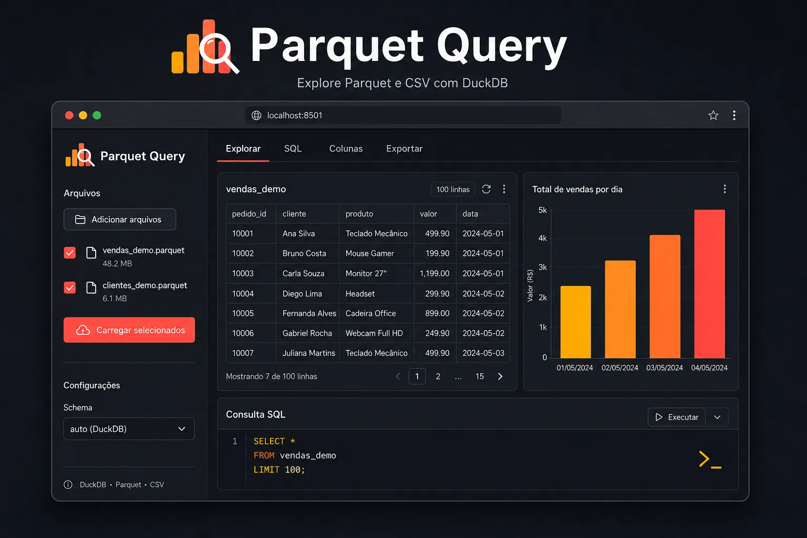

# Parquet Query

Aplicação **Streamlit** para explorar arquivos **Parquet** e **CSV** com **DuckDB** — SQL ad-hoc, colunas calculadas (DuckDB ou DAX do Power BI), tradutor Power Query (M) e exportação versionada em `data/`.



**Requisitos:** Python 3.10+ · Windows, Linux ou macOS · Licença [MIT](LICENSE)

---

## Experimente online

**[parquet-query.streamlit.app](https://parquet-query.streamlit.app)** — demo pública no Streamlit Community Cloud. Os datasets de exemplo (`vendas_demo` ~10k linhas e `clientes_demo`) carregam automaticamente; também dá para enviar um `.parquet`/`.csv` (até 50 MB). Há receitas SQL/DAX/M na interface. Exportação por download; versionamento persistente fica na [versão local](#download-portátil).

Testar o modo cloud localmente:

```bash
set PQ_CLOUD_MODE=1          # Windows cmd
# ou: $env:PQ_CLOUD_MODE=1  # PowerShell
streamlit run app.py
```

---

## Download (portátil)

Sem Python instalado: baixe o pacote na [página de Releases](https://github.com/GuilhermeRoesler/ParquetQuery/releases).

| Plataforma | Arquivo | Como iniciar |
|------------|---------|--------------|
| Windows x64 | `ParquetQuery-{versão}-win64-setup.exe` | Execute o instalador; atalho **Parquet Query** no menu Iniciar |
| Windows x64 (ZIP) | `ParquetQuery-{versão}-win64.zip` | Extraia e dê duplo clique em **`Iniciar Parquet Query.bat`** |
| Linux x64 / ARM64 | `ParquetQuery-{versão}-linux-*.tar.gz` | `./iniciar-parquet-query.sh` |
| macOS Apple Silicon (ARM64) | `ParquetQuery-{versão}-macos-arm64.tar.gz` | `./iniciar-parquet-query.sh` |

1. Instale (`.exe`) ou extraia o pacote (ZIP/tar)
2. Coloque `.parquet` ou `.csv` na pasta `data/` (no instalador Windows: em `%LOCALAPPDATA%\Programs\Parquet Query\data`)
3. Inicie com o atalho ou launcher da tabela acima

O navegador abre sozinho quando possível. Detalhes no `LEIA-ME.txt` dentro do pacote.

> **Windows:** o sistema pode avisar que o app não é assinado — normal em releases open source. Use «Mais informações» → «Executar assim mesmo» se confiar na origem.
>
> **Linux/macOS:** se necessário, `chmod +x iniciar-parquet-query.sh`. No Linux, use uma distribuição com glibc recente (Ubuntu 20.04+, Debian 11+, etc.).

---

## Início rápido

1. Coloque arquivos `.parquet` ou `.csv` na pasta `data/`.
2. Inicie o app:

```bash
# Windows
run.bat          # ou: run.ps1

# Linux / macOS
./run.sh
```

3. Abra o navegador em `http://127.0.0.1:8501` (porta alternativa se 8501 estiver ocupada).

Os scripts de launch criam/ativam `.venv`, instalam dependências, garantem `data/` e sobem o Streamlit. Flag `--dev` / `-Dev` instala pytest e ruff.

---

## Uso do app

1. **Abrir** — sidebar: na 1ª visita o primeiro arquivo em `data/` abre sozinho; depois marque e clique **Abrir arquivo** (ou **Carregar selecionados** se houver vários)
2. **Explorar** — schema, preview automático (todas as colunas; seleção customizada exige Atualizar), overview classificatório ou numérico
3. **SQL** — editor DuckDB; **Ctrl+Enter** ou Executar; tradutor M no expander
4. **Colunas** — adicionar (SQL ou DAX), renomear, remover, TRY_CAST; badge quando há transformações ativas
5. **Exportar** — download ou salvar em `data/` como nova versão (`{base}_vN`) ou sobrescrever

Versões exportadas: `vendas_v1.parquet`, `vendas_v2.parquet`, … O original fica como `vendas.parquet` (sem sufixo).

Glossário rápido na sidebar: **tabela** (arquivo carregado), **base** (nome sem `_vN`), **versão**, **colunas calculadas**.

---

## O que o app faz

| Recurso | Descrição |
|---------|-----------|
| **Explorar** | Schema, preview paginado (automático com todas as colunas) e overview de valores (classificatório ou numérico) |
| **SQL** | Editor com autocomplete; execução paginada server-side; tradutor M → SQL |
| **Colunas** | Colunas calculadas (SQL ou DAX), renomear, remover, TRY_CAST |
| **Exportar** | Download ou salvar em `data/` com versionamento `{base}_vN` e timeline |

Dados grandes são processados no DuckDB — paginação e export Parquet/CSV via `COPY`, sem carregar o dataset inteiro na RAM.

---

## Desenvolvimento

```bash
./run.sh --dev          # Linux/macOS
run.ps1 -Dev            # Windows

# Ou manualmente
python -m venv .venv
.venv\Scripts\activate          # Windows
pip install -e ".[dev]"         # ou: -r requirements.txt -r requirements-dev.txt

python -m pytest tests/ -q --cov=pq
python -m ruff check .
python -m ruff format --check .
python -m mypy pq --config-file pyproject.toml
pre-commit install   # opcional: hooks locais espelhando o CI
```

CI (GitHub Actions): Ruff (lint + format), pytest em Python 3.10/3.11/3.12 com cobertura mínima, mypy e `pip-audit`. Dependabot abre PRs semanais de dependências.

Dependências: fonte de verdade em `pyproject.toml`; `requirements.txt` / `requirements-dev.txt` são espelhos (Streamlit Cloud e build portátil).

### Publicar release (pacotes portáteis)

1. Atualize `version` em `pyproject.toml` se necessário
2. Crie e envie uma tag semver: `git tag v1.6.5 && git push origin v1.6.5`
3. O workflow **Release** gera os pacotes Windows (ZIP + setup.exe) / Linux / macOS ARM64 e anexa ao GitHub Release

Build local:

```bash
# Windows (ZIP + instalador; requer Inno Setup 6)
powershell -File scripts/build_portable.ps1 -Version 1.6.5

# Windows só ZIP
powershell -File scripts/build_portable.ps1 -Version 1.6.5 -SkipInstaller

# Linux / macOS (detecta o host; ou passe --target)
chmod +x scripts/build_portable.sh
./scripts/build_portable.sh --version 1.6.5
./scripts/build_portable.sh --version 1.6.5 --target linux-x64
# macOS Intel (não sai no CI; só build local):
./scripts/build_portable.sh --version 1.6.5 --target macos-x64
```

### Publicar demo online (Streamlit Community Cloud)

App publicado em [parquet-query.streamlit.app](https://parquet-query.streamlit.app). Para redeploy ou fork:

1. Push do repositório (inclui `demo/vendas_demo.parquet` e `demo/clientes_demo.parquet`).
2. Em [share.streamlit.io](https://share.streamlit.io): **New app** → repo → branch `main` → **`app.py`**.
3. `requirements.txt` na raiz; `.streamlit/config.toml` limita upload a 50 MB.

**Documentação:** decisões técnicas ficam em `.cursor/skills/*/SKILL.md`; ao mudar código, atualize a skill afetada e este `README.md` se a mudança for user-facing — doc e código devem refletir um ao outro.

---

## Estrutura do projeto

```
app.py              # Entrada Streamlit
assets/             # Ícone do app (png/svg/ico)
docs/screenshots/   # Demo (webp no README; png fonte)
pq/                 # Pacote principal
  db/               # DuckDB — conexão, schema, derived, paginação
  ui/               # Streamlit — sidebar, abas, componentes
  export/           # COPY/streaming, io
  storage/          # Versionamento + _manifest.json
  translators/      # DAX e M → SQL
  overview/         # SQL de overview, formatação pt-BR
scripts/            # Build portátil, find_free_port, gen_demo
installer/          # Script Inno Setup (Windows setup.exe)
demo/               # Dataset de exemplo (modo vitrine / Streamlit Cloud)
data/               # Arquivos + _manifest.json
tests/              # pytest
LICENSE             # MIT
.cursor/skills/     # Decisões técnicas (skills) + rules ponteiro
```

---

## Solução de problemas

| Sintoma | Ação |
|---------|------|
| Porta 8501 ocupada | Scripts tentam 8502+; ou `STREAMLIT_SERVER_PORT` |
| Exportar «Último resultado» vazio | Execute um SELECT na aba SQL primeiro |
| XLSX truncado (>1M linhas) | Use Parquet ou CSV |
| DAX «função não suportada» | Reescreva em SQL DuckDB na aba Colunas |
| Arquivo exportado não aparece | Marque na sidebar e **Carregar** |
| `_manifest.json` corrompido | Sidebar avisa; próximo save recria metadados |

---

## Documentação

| Arquivo | Conteúdo | Quando atualizar |
|---------|----------|------------------|
| **`.cursor/skills/*/SKILL.md`** | Decisões técnicas, armadilhas, mapa de edição (fonte canônica) | Mudança de arquitetura, convenções ou comportamento interno |
| **README.md** (este) | Uso, dev, troubleshooting | Mudança visível ao usuário ou ao fluxo de setup |

Rules em `.cursor/rules/` apontam para as skills. Detalhes de tradutores DAX/M: código em `pq/translators/` + skill `translators`. Doc e código devem estar sempre alinhados.
